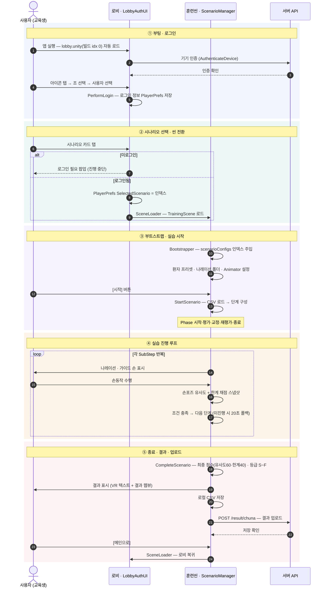

# GuideChuna 전체 실행 시퀀스

> **문서 성격**: 앱 시작부터 로그인 → 실습 진행 → 종료·결과 업로드까지의 **전체 실행 순서**를 한 흐름으로 보여주는 시퀀스 자료
> **대상**: 개발 인수인계·팀 내부 / 발표·공유
> **작성 기준일**: 2026-07-22 (커밋 `4a2e06b` 실제 코드 흐름)
> **관련**: 세부 파일·라인은 `프로그램_운용개념_흐름_2026-07.md` 참조. 웹 다이어그램 버전은 아티팩트로도 게시됨.

> 💡 이 문서는 **편집 편의를 위한 md 원본**입니다. 아래 ` ```mermaid ` 블록은 GitHub·VS Code·대부분의 마크다운 뷰어에서 다이어그램으로 렌더됩니다.
> ⚠️ 단, 프로젝트의 md→PDF 파이프라인(Chrome headless)은 mermaid를 렌더하지 못해 **PDF로 뽑으면 코드가 그대로 보입니다.** PDF가 필요하면 렌더된 다이어그램을 이미지로 캡처해 삽입하세요.

---

## 국면 요약

실행은 5국면으로 순차 진행된다. (번호 = 실행 순서)

| # | 국면 | 요약 | 주관 |
|---|------|------|------|
| ① | **부팅 · 로그인** | 로비 자동 로드 → 기기 인증 → 조·사용자 선택 로그인 | `LobbyAuthUI_Complete` |
| ② | **선택 · 씬 전환** | 시나리오 카드 탭 → 로그인 게이트 → 훈련씬 로드 | `LobbyAuthUI_Complete` / `SceneLoader` |
| ③ | **부트스트랩 · 시작** | config 주입 → [시작] → CSV 로드 · 단계 구성 | `ScenarioBootstrapper` / `ScenarioManager` |
| ④ | **실습 진행 루프** | 단계별 안내 → 손동작 → 유사도·한계 채점 → 다음 | `ScenarioManager` / `ScenarioConditionManager` |
| ⑤ | **종료 · 업로드** | 최종 채점 → 결과 표시·저장 → 서버 전송 → 로비 복귀 | `TrainingResult*` / `AuthenticationService` |

---

## 시퀀스 다이어그램



---

## 핵심 계약

- **씬 간 계약** — 로비→훈련씬 전달은 `PlayerPrefs` 하나. 핵심 키 `SelectedScenario`(배열 인덱스). 직접 참조 없이 느슨한 결합.
- **진행 게이트** — 단계 완료는 조건 폴링(손포즈·접촉·자세)으로 판정. 20초 무진행 시 수동 [다음] 폴백이 뜨되 폴링은 계속.
- **채점** — 유사도 60% + 한계 40%, S~F 등급. 연습·평가 모두 채점하되 **평가**만 공식·업로드·중도이탈 저장.
- **서버** — `POST /result/chuna` 로 결과 전송(사용자·기관·시나리오·요약·시간). 인증 정보 없으면 로컬 CSV만 저장.

---

*국면 번호는 실행 순서. 세부 파일·라인은 「프로그램 운용개념·흐름」 문서 참조.*
